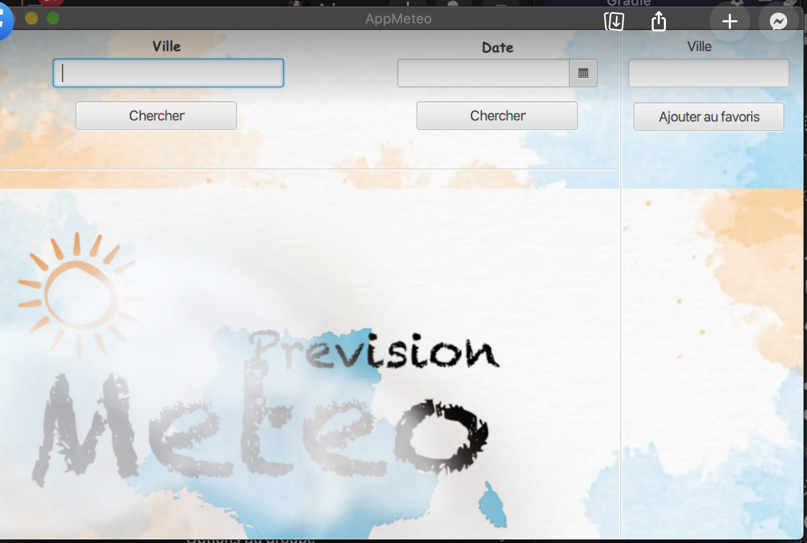
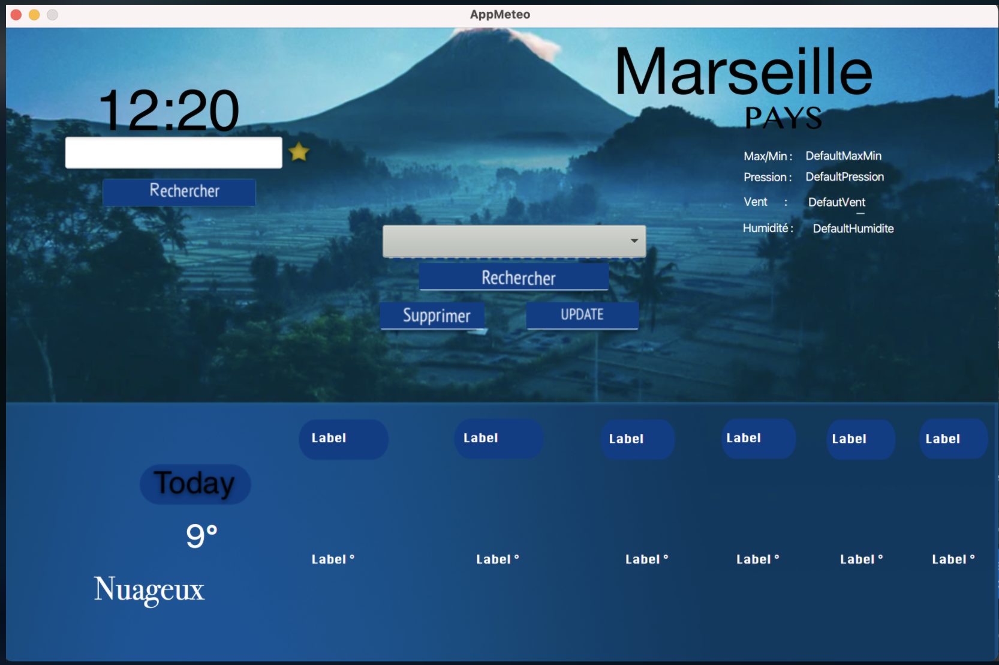
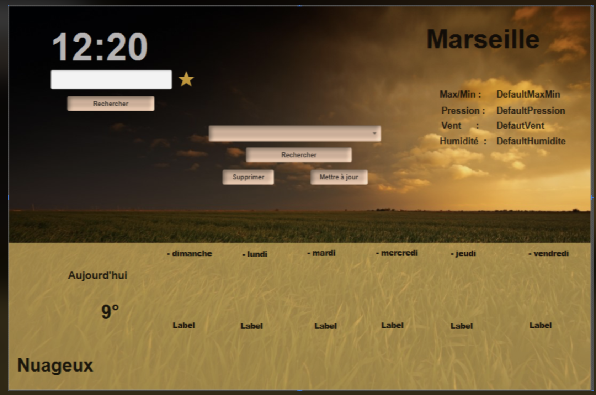
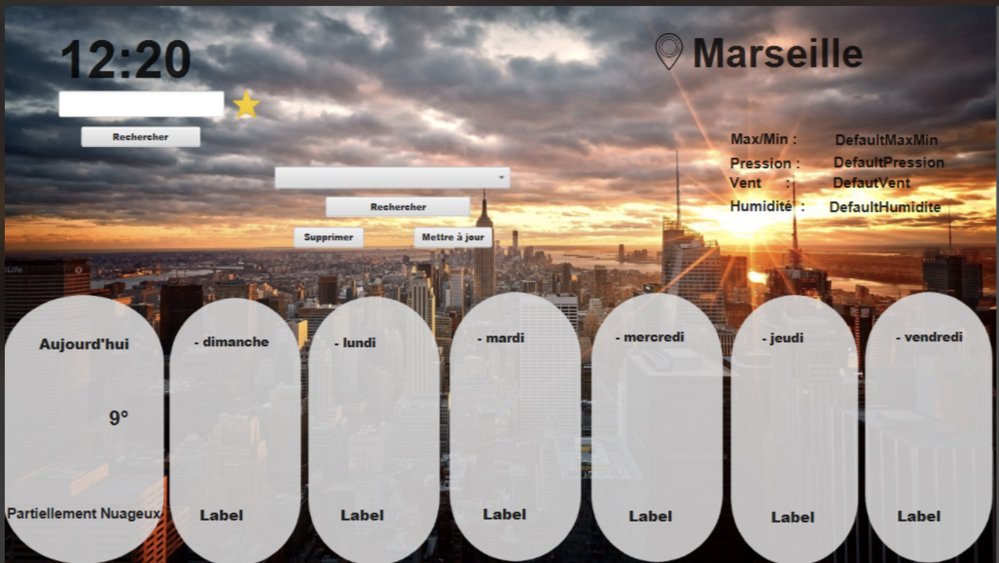

# :high_brightness: AppMeteo

> Ceci est le projet de base pour l'UE Projet: initiation génie logiciel.
<h2> :mag: What is an API ? </h2>
<p> - In computer science, an application programming interface1 or application programming interface2,3,4 (often referred to as API for Application Programming Interface) is a standardized set of classes, methods, functions, and constants that serve as a facade by which software offers services to other software. It is offered by a software library or a web service, most often accompanied by a description that specifies how consumer programs can use the functionality of the provider program.<p>


<h2> :unlock: Search for cities using an API: </h2>
+ [ Added classes that allow us to read data from the API. ] <br>
+ [ Added  elements allowing to manipulate the data via the UI .]
<h1> :unlock: Favorite</h1>
+ [Add favorite to a list ].<br>
+ [Add button  'add/delete' favorite].
<h2> :unlock: DAY BY DAY API :</h2>
+ [ Added classes that allow us to read data from the API (FOR EACH DAY). ] <br>
+ [ Added elements allowing to manipulate the data via the interface.]
<h2> :unlock: Graphic interface</h2>
+ [ Update of graphic design   . ] <br>
+ [ Update of  graphic content . ]
<h2>Evolution of GUI<h2>
<details>
<h2> :date: Version 1 : </h2>

<h2> :date: Version 2 :</h2>

<h2> :date: Version 3 :</h2>

<h2> :date: Version 4 :</h2>

<h2> 🏆 Final version :</h2>


</details>
<h1> Demonstration use of the application</h1>
<h2><h2>
 <details> 
<h2>Search city </h2>

<h2>Add city to favorite </h2>

<h2>Delete city from favorite </h2>
<h2>Search favorite city </h2>

<h2> Move your mouse to get current hour/min</h2>

</details>
<h1> :bar_chart: Coding stats </h1>

```
JAVAFX       15 hrs 41 mins  ██████████████▓░░░░░░░░░░   59.75 % 
Java         10 hrs 27 mins  ███████▒░░░░░░░░░░░░░░░░░   11.05 % 
CSS          1 hr 50 mins    ██▒░░░░░░░░░░░░░░░░░░░░░░   09.04 % 
Other        20 hr 27 mins   ██████████░░░░░░░░░░░░░░░   20.00 % 
```

<h1> :mortar_board: NAME OF PARTICIPANTS : </h1>
    
> -Adnane Afifi. 
   
> -Tassadit Kettouche.
  
> -Lamia Dekkar.
    
> -Addouche walid.

> -Redjem Amir.

